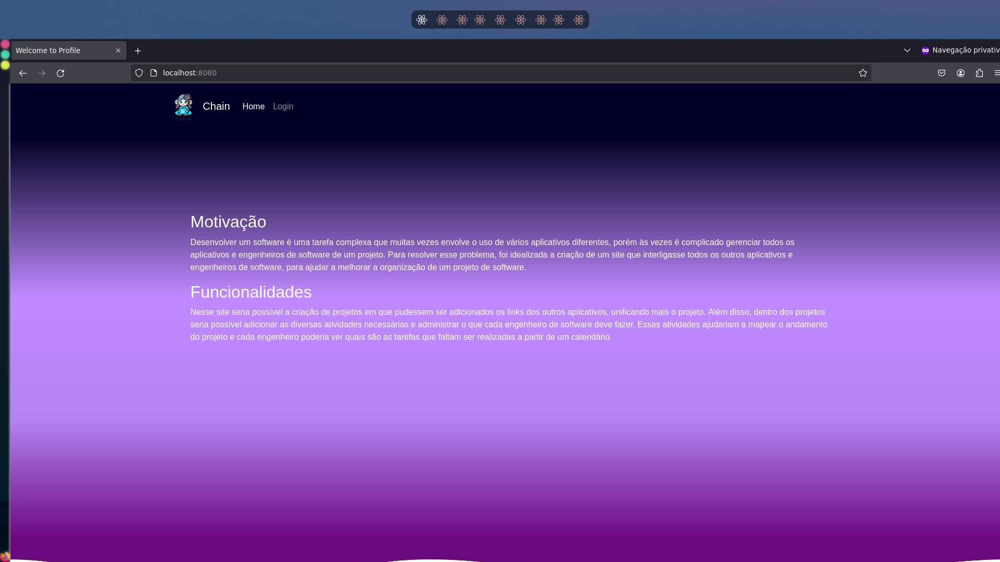
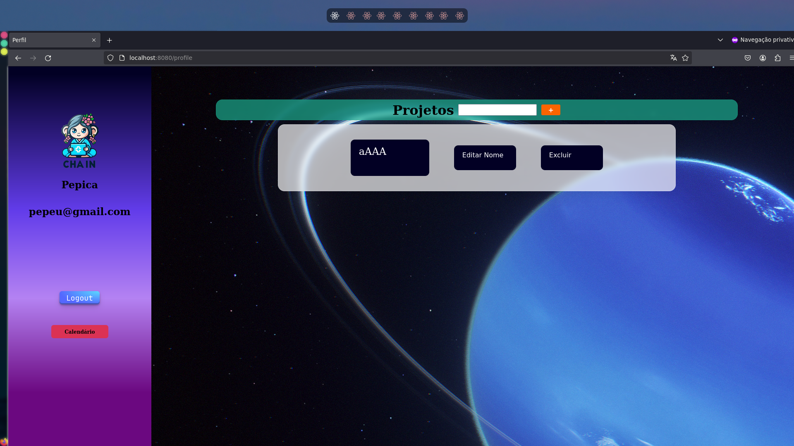
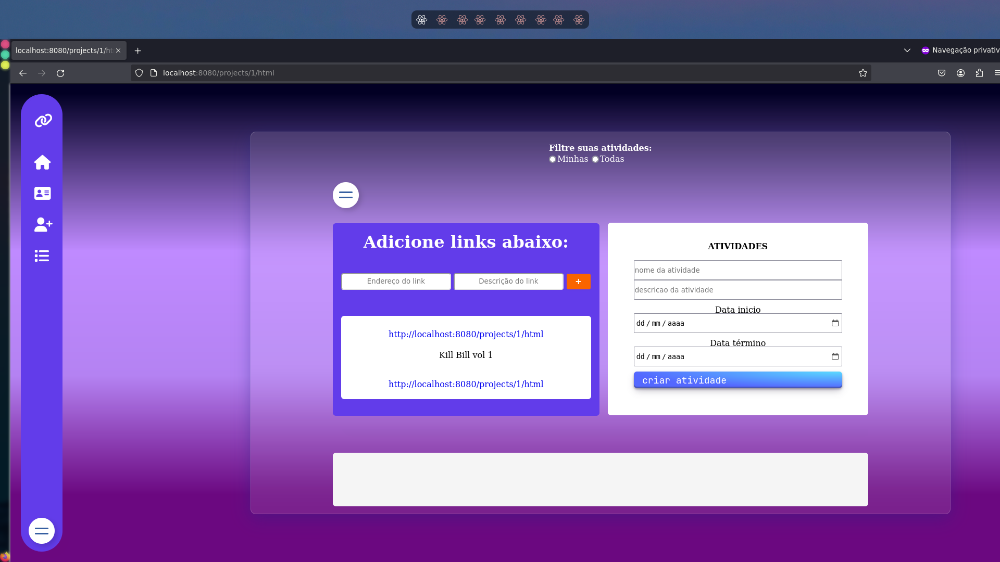

# Descrição do Sistema
## Chain: Sistema de Gerenciamento de Projetos

O Chain é uma plataforma completa projetada para otimizar a gestão de projetos e equipes de desenvolvimento de software. Inspirado na ideia de conectar pessoas como elos de uma corrente, o Chain oferece uma experiência intuitiva e eficiente para colaboração e organização.

## Recursos Principais

- Página Inicial Atraente: Uma interface visualmente atraente dá as boas-vindas aos usuários, destacando a proposta do sistema e oferecendo fácil acesso à tela de login.

- Autenticação Segura: Com o Chain, os usuários podem criar uma conta ou fazer login de forma segura, garantindo acesso personalizado às funcionalidades do sistema.

- Perfil do Usuário: Após o login, os usuários são redirecionados para sua página de perfil, onde podem visualizar e acessar facilmente o calendário de atividades e os projetos aos quais estão vinculados. Além disso, eles têm a opção de criar novos projetos conforme necessário.

-  Gestão de Projetos Eficiente: Como administrador ou criador de projeto, os usuários têm a capacidade de convidar membros da equipe, atribuir atividades com datas de início e término e designar responsáveis por cada tarefa. Isso promove uma gestão eficaz do progresso do projeto e da distribuição de tarefas.

- Organização de Links e Comentários: O Chain oferece uma lista dedicada para adicionar links relevantes ao projeto, permitindo que os membros da equipe compartilhem recursos importantes e comentários sobre eles. Essa funcionalidade melhora a colaboração e a comunicação dentro do projeto.

- Comentários no Calendário: Os usuários podem adicionar comentários diretamente ao calendário, fornecendo informações contextuais adicionais sobre atividades específicas ou eventos importantes. Isso facilita a comunicação e o acompanhamento do progresso do projeto.

- LogOut Seguro: Para garantir a privacidade e segurança dos usuários, o Chain oferece uma opção de logout fácil de usar na tela de perfil, permitindo que os usuários encerrem sua sessão quando desejarem.

O Chain é uma solução abrangente para organizar, criar e gerenciar projetos de forma eficiente, proporcionando uma colaboração harmoniosa entre os membros da equipe. Com sua interface amigável e recursos poderosos, o Chain eleva a produtividade e o sucesso dos projetos de desenvolvimento de software.
# Diagrama de Casos de Uso

# Diagrama de Classes do Sistema

# Modelo Relacional 

# HomePage

# Perfil

# Projeto

